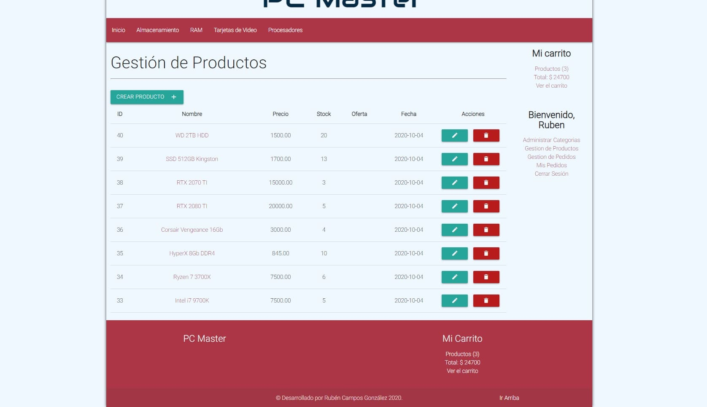

# PcMaster
Project coded with PHP using a MVC arquitecture, implemented a shopping cart, a session system and other stuff, with more security in general.
Added a new design with Materialize Framework, mobile support included.

Deployed on Heroku https://pc-master.herokuapp.com/

## Demo screenshots

### Mobile

